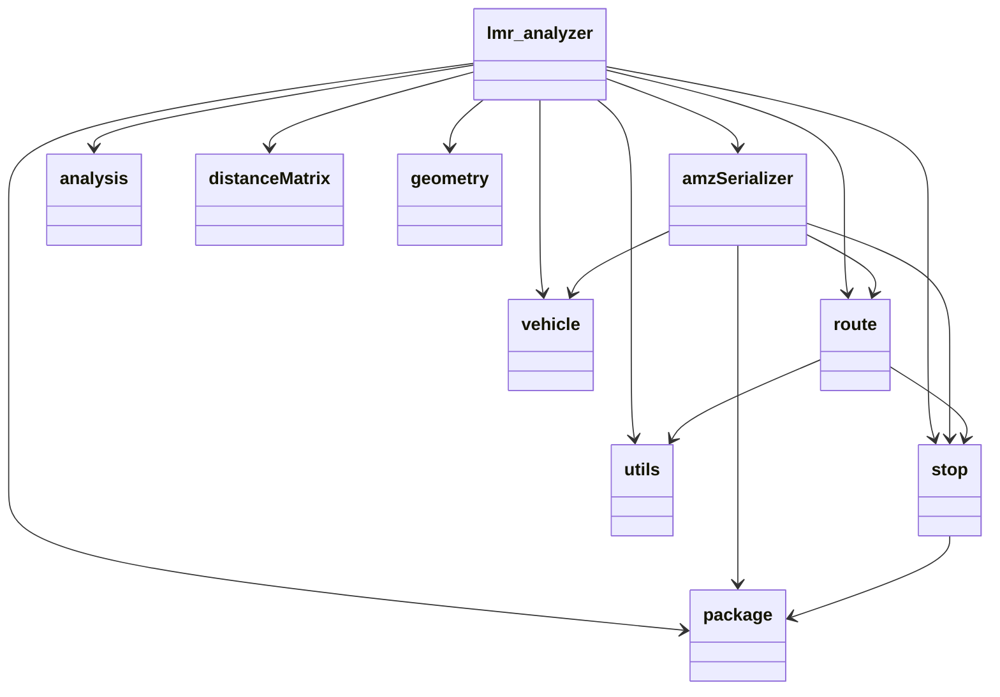

# Last-Mile-Routing-Analyzer
[](https://zenodo.org/badge/latestdoi/509784638) [](https://opensource.org/licenses/MPL-2.0) [](https://www.codefactor.io/repository/github/gui-fernandesbr/last-mile-routing-analyzer/overview/develop)

<p align="center">
 </p>

<p align="center">
 </p>

## Table of Contents
- [Last-Mile-Routing-Analyzer](#last-mile-routing-analyzer)
  - [Table of Contents](#table-of-contents)
  - [Motivation](#motivation)
  - [Features:](#features)
  - [Installation](#installation)
  - [Data folder description](#data-folder-description)
  - [Contributing](#contributing)
  - [License](#license)
  - [Citation](#citation)
  - [Contact](#contact)

## Motivation

- Repository referred to a [final thesis](https://github.com/Gui-FernandesBR/TCC-2022) presented to the University of Sao Paulo in order to achieve the Civil Engineering degree.
- The main goal was to develop a tool that could be used to analyze the last mile routing problems in a city
- In the end, a combination of different last-mile statics and street network analysis was made possible, allowing for significant insights to be made on the city's last mile routing problems.
- The project is still going to be developed and maintained even after the thesis is finished, so any contribution is welcome.


## Features:

The tool was developed in Python and it is able to analyze the last mile routing problems in a city, considering the following aspects:
- **Last Mile routing data**
  - Distance between origin and the destination
    - Shortest driving path and the 
    - euclidean distance by [Haversine](https://en.wikipedia.org/wiki/Haversine_formula) formula;
  - Routes center of gravity
  - Percentage of rejected deliveries, and failed attempts 
- **Street networks geometry**:
  - Street Network density statistics for different neighborhoods:
    - Node density, edge density, self-loop proportion
    - Street total length, average street length
    - etc.
  - Street Network **connectivity** and **orientation** statistics for different neighborhoods:
    - Node degree
    - Polar plots of street orientation


## Installation

First you need to certify that you have [Python 3.9](https://www.python.org/downloads/release/python-380/) installed.

Then you can install the package using pip:

```bash	
pip install git+https://github.com/Gui-FernandesBR/Last-Mile-Routing-Analyzer/lmr_analyzer.git
```	

The package will automatically install the dependencies listed at [requirements.txt]() file.

## Getting started with examples

Here are some of the examples that you can run to get started with the package:

* [](https://github.com/Gui-FernandesBR/Last-Mile-Routing-Analyzer/blob/master/docs/notebooks/lmr_analyzer/lmr_analyzer_example.ipynb) - Main example notebook with all the features of lmr_analyzer package.

* [](https://github.com/Gui-FernandesBR/Last-Mile-Routing-Analyzer/blob/master/docs/notebooks/lmr_analyzer/geometry_class_example.ipynb) - Example over Los Angeles city using the geometry class.

## Read the documentation

The documentation is still under development, please be patient.
You can check the current docstring of each method and class individually.

## Directory Structure

The repository is organized as follows:

``` bash
  .github/             - Github related files
  data/                - Data used in or generated with the examples
  docs/                - Documentation files
  source/              - Main package files
  tests/               - Tests for the package
  .gitattributes       - Git attributes file
  .gitignore           - Files to be ignored by git
  CITATION.cff         - Citation file
  LICENSE.md           - License file
  README.md            - This file
  requirements-dev.txt - Python packages required to develop the package
  requirements.txt     - Python packages required to run the package
  setup.py             - Setup file
```	


## Library Structure

The lmr_analyzer package is organized as follows:

    __init__.py          - Main module
    amz_serializer.py    - Amazon S3 data serializer
    analysis.py          - Analysis module, to analyze a set of routes
    distance_matrix.py   - Distance Matrix module
    geometry.py          - Handle with spatial information from shapefiles
    package.py           - Store package information
    route.py             - Store route information
    stop.py              - Store stop information
    utils.py             - Utilities module to be used on other modules
    vehicle.py           - Store vehicle information

The architecture of the package is represented by the following diagram:



## Data folder description

Due to the large amount of information, the data folder can be a bit confusing, so here is a brief description of what each folder contains:

* data/driving_distances:
  * A set of csv files containing the driving distances between some pairs of points in the dataset. The files are named as follows: `driving_distances_{dataset_name}.csv`. The dataset name is the same as the name of the folder containing the dataset. 
* data/shapefiles: 
  * `los_angeles_majors`: Shapefile containing the major neighborhoods of Los Angeles.
  * `los_angeles_minors`: Shapefile containing the minor neighborhoods of Los Angeles.
  * `guarulhos_osm` : geospatial data describing boundaries of all neighborhoods of the Guarulhos city. source: _OpenStreetMap_
  * `urban_regions_Sao_Paulo`: geospatial data describing land use over state of Sao Paulo. source: unknown

## Contributing

Pull requests are welcome. For major changes, please open an issue first to discuss what you would like to change. Any contributor should be aware of the [code of conduct](https://github.com/Gui-FernandesBR/Last-Mile-Routing-Analyzer/blob/master/CODE_OF_CONDUCT.md).

You can also contribute by opening an issue with a bug report or a feature request.

## License

First of all, thank you for considering contributing to the project!

The quicker step to contribute is by starring the project, which will help it to be more visible to other people.

The project is licensed under the [Mozila Public License 2.0](), which can be found [here](). For any questions, please contact the main maintainer.

## Citation

If you use this package in your research, please cite it as:

```bibtex

@misc{alves-lmr,
  author = {Guilherme Fernandes Alves},
  title = {Last Mile Routing Analyzer: a powerful toolkit to analyze the interaction between last mile operations and the street network design.},
  year = {2023},
  publisher = {GitHub},
  journal = {GitHub repository},
  howpublished = {\url{https://github.com/Gui-FernandesBR/Last-Mile-Routing-Analyzer}},
  doi = {10.5281/zenodo.6792976}
}

```	

## Contact

Send a message to the main maintainer to request more details: [Guilherme Fernandes Alves](@Gui-FernandesBR).
you can find him (i.e. me) by e-mail: `guilherme_fernandes@usp.br` or `gf10.alves@gmail.com`
